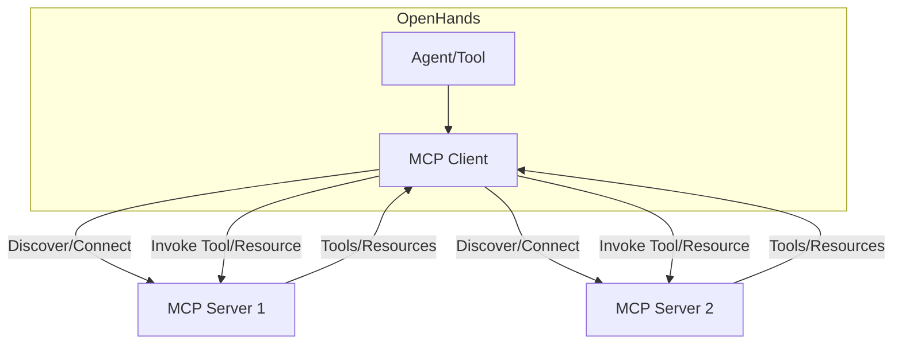

# Using MCP Servers with OpenHands

## Overview: What Are MCP Servers?

**Model Context Protocol (MCP) servers** are external services that expose tools and resources to clients via a standardized protocol. In the OpenHands ecosystem, MCP servers enable dynamic extension of agent capabilities by providing access to specialized tools, APIs, or data sources. MCP servers can be local (running on the same machine) or remote (hosted on a custom domain or cloud).

**OpenHands** acts as an MCP client, discovering, connecting to, and interacting with one or more MCP servers. This allows agents within OpenHands to leverage external capabilities as if they were native tools, supporting advanced workflows, automation, and integration with third-party systems.

---

## How OpenHands Interacts with MCP Servers

- **Discovery:** OpenHands loads MCP server configurations at startup from configuration files and environment variables.
- **Connection:** OpenHands establishes communication with each configured MCP server, supporting both local (stdio) and remote (HTTP/SSE) protocols.
- **Tool/Resource Registry:** Each MCP server advertises its available tools and resources. OpenHands registers these, making them available to agents.
- **Invocation:** When an agent or tool requests a capability, OpenHands routes the request to the appropriate MCP server, handles the response, and returns results to the agent.



---

## Configuring MCP Servers in OpenHands

MCP server configuration is flexible and can be managed via configuration files (TOML/YAML/JSON) or environment variables.

### 1. Configuration File Example

Add MCP server definitions to your main configuration file (e.g., `config.toml`):

```toml
[mcp_servers]

# Local MCP server (stdio)
[[mcp_servers]]
name = "filesystem"
type = "local"
command = "docker run -i --rm --init -v /host/path:/container/path tribehealth/filesystem-mcp:latest.arm /container/path"

# Remote MCP server (HTTP/SSE)
[[mcp_servers]]
name = "weather"
type = "remote"
url = "https://weather.example.com"
auth_token = "YOUR_API_TOKEN"  # Optional, see authentication below
```

### 2. Environment Variable Configuration

You can also configure MCP servers using environment variables, which is useful for containerized or cloud deployments:

```bash
# Example for a remote MCP server
OPENHANDS_MCP_SERVERS='[{"name":"weather","type":"remote","url":"https://weather.example.com","auth_token":"YOUR_API_TOKEN"}]'
```

- The environment variable should contain a JSON array of server definitions.
- If both config file and environment variable are present, environment variables take precedence.

### 3. Configuration Options

| Option      | Description                                      | Required | Example                                  |
|-------------|--------------------------------------------------|----------|-------------------------------------------|
| name        | Unique identifier for the MCP server             | Yes      | "filesystem"                              |
| type        | "local" or "remote"                              | Yes      | "local"                                   |
| command     | Command to launch local server (if type=local)   | For local| "docker run ..."                          |
| url         | URL for remote server (if type=remote)           | For remote| "https://weather.example.com"             |
| auth_token  | Bearer token for authentication (optional)       | No       | "YOUR_API_TOKEN"                          |

---

## Discovering and Using MCP Server Capabilities

### 1. Tool and Resource Discovery

- On startup, OpenHands queries each MCP server for its available tools and resources.
- Each tool/resource is registered in the OpenHands tool registry, making it available to agents.
- Tools are described with input/output schemas, names, and descriptions.

### 2. Agent/Tool Usage

- Agents can invoke MCP tools/resources by name, passing required parameters.
- OpenHands handles serialization, communication, and error handling transparently.
- Example: An agent can call a weather tool on a remote MCP server as if it were a local function.

### 3. Dynamic Updates

- If an MCP server is restarted or its capabilities change, OpenHands can refresh the registry (manual reload may be required).

---

## Limitations and Caveats

- **Connection Reliability:** If an MCP server is unavailable at startup, its tools/resources will not be registered. Hot-plugging servers at runtime is not yet fully supported.
- **Schema Validation:** OpenHands relies on the schemas provided by MCP servers. Malformed or incomplete schemas may cause runtime errors.
- **Authentication:** Only bearer token authentication is supported for remote servers. Other methods (OAuth, mTLS) are not yet implemented.
- **CORS:** For browser-based deployments, ensure remote MCP servers set appropriate CORS headers.
- **Performance:** Latency for remote MCP servers may impact agent response times.
- **Security:** Only connect to trusted MCP servers. Malicious servers could expose sensitive data or execute harmful actions.

---

## Running MCP Servers on a Custom Domain

When deploying MCP servers on a custom domain, consider the following:

### 1. Networking

- Ensure the MCP server is accessible from the OpenHands client (public IP or VPN).
- For local development, use port forwarding or tunneling (e.g., ngrok) if needed.

### 2. Authentication

- Use bearer tokens for authentication. Set the `auth_token` in the OpenHands config or environment variable.
- The MCP server should validate the `Authorization: Bearer <token>` header on incoming requests.

### 3. CORS (Cross-Origin Resource Sharing)

- For web-based OpenHands clients, the MCP server **must** set CORS headers:
    - `Access-Control-Allow-Origin: *` (or restrict to your domain)
    - `Access-Control-Allow-Methods: POST, GET, OPTIONS`
    - `Access-Control-Allow-Headers: Content-Type, Authorization`
- Example (for Flask):
    ```python
    from flask import Flask
    from flask_cors import CORS

    app = Flask(__name__)
    CORS(app, origins=["https://yourdomain.com"])
    ```

### 4. HTTPS

- Always use HTTPS for remote MCP servers to protect data in transit.
- Obtain a valid SSL certificate for your custom domain.

### 5. Example NGINX Reverse Proxy

See `docs/nginx.conf.example` for a sample NGINX configuration to proxy requests to your MCP server securely.

### 6. OpenHands Custom Domain Integration

- Set the `CUSTOM_DOMAIN_URL` environment variable to your domain (e.g., `https://openhands.skytok.net`).
- For Docker Compose, add `CUSTOM_DOMAIN_URL` and `DOCKER_CONTAINER=true` to the environment section.
- See `docs/custom-domain-setup.md` for more details.

---

## Troubleshooting

- **Server Not Detected:** Check logs for connection errors. Verify network/firewall settings.
- **Tool Not Registered:** Ensure the MCP server advertises its tools/resources correctly.
- **CORS Errors:** Adjust CORS headers on the MCP server.
- **Authentication Failures:** Confirm the correct token is set in both OpenHands and the MCP server.

---

## Further Reading

- [OpenHands Architecture Documentation](./modules/usage/architecture/backend.mdx)
- [MCP Protocol Specification](link-to-spec-if-available)
- [Example MCP Server Implementations](link-to-examples-if-available)