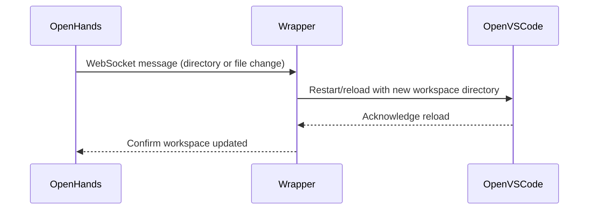

# OpenVSCode Working Directory Sync Plan

## Overview

This document describes the plan for synchronizing OpenVSCode’s working directory with the current OpenHands project/session directory, using the new wrapper project as the orchestrator. The wrapper connects to OpenHands via WebSocket, listens for directory and file change signals, and manages the OpenVSCode process accordingly.

## Problem Statement & Requirements

- **Problem:** OpenVSCode is initially launched with a specific project directory, but when the OpenHands project/session changes, OpenVSCode does not automatically update its workspace.
- **Requirements:**
  - OpenVSCode must always reflect the current OpenHands project/session directory.
  - Updates should occur dynamically at runtime, not just at initial launch.
  - The solution should be robust, extensible, and minimize user disruption.

## Architecture & Chosen Solution

### Wrapper-Orchestrated Sync

- The **wrapper project** is responsible for launching OpenVSCode and maintaining its workspace in sync with OpenHands.
- The wrapper establishes a persistent WebSocket connection to OpenHands.
- When OpenHands signals a project/session directory change (or file changes), the wrapper receives the event and takes appropriate action (e.g., restarting OpenVSCode with the new directory).
- This approach decouples OpenHands and OpenVSCode, centralizing orchestration logic in the wrapper.

### Rationale

- Centralizing orchestration in the wrapper simplifies the architecture and makes it easier to extend or modify sync logic.
- WebSocket-based signaling supports real-time, runtime updates.
- The wrapper can also handle file-level sync events, not just directory changes.

## Implementation Plan

1. **Wrapper Launches OpenVSCode**
   - The wrapper starts OpenVSCode as a child process, passing the initial workspace directory.

2. **Wrapper Connects to OpenHands**
   - The wrapper establishes a WebSocket connection to OpenHands, registering for project/session and file change events.

3. **OpenHands Signals Directory or File Changes**
   - When the active project/session changes, OpenHands sends a message (e.g., `project_switch` or `workspace_reload`) to the wrapper via WebSocket, including the new directory path.
   - File-level changes are also signaled as needed.

4. **Wrapper Handles Directory Change**
   - Upon receiving a directory change event, the wrapper gracefully restarts or reloads OpenVSCode with the new workspace directory.

5. **Wrapper Handles File Changes**
   - The wrapper can also propagate file change events to OpenVSCode or OpenHands as appropriate.

6. **Initial Launch Remains Unchanged**
   - The initial launch logic is unchanged; runtime updates are handled via signaling.

7. **Testing & Validation**
   - Test the end-to-end flow: project/session change in OpenHands → wrapper receives event → OpenVSCode workspace updates.

### Sequence Diagram

## Alternatives Considered

### 1. File-Based Signaling

- **Description:** Write the new directory path to a file, and have OpenVSCode or the wrapper poll/watch for changes.
- **Rejected Because:** Only effective at initial launch; runtime updates require complex polling or file watching.

### 2. Environment Variable

- **Description:** Set an environment variable with the project path before launching OpenVSCode.
- **Rejected Because:** Environment variables are static for a process lifetime; do not support runtime changes.

### 3. Direct OpenHands → OpenVSCode Controller Signaling

- **Description:** OpenHands signals the OpenVSCode controller directly.
- **Rejected Because:** The wrapper is the correct place for orchestration, as it manages the OpenVSCode process lifecycle and sync logic.

### 4. Wrapper-Orchestrated WebSocket Sync (Chosen)

- **Description:** The wrapper connects to OpenHands via WebSocket, receives directory and file change events, and manages OpenVSCode accordingly.
- **Accepted Because:** Supports real-time, runtime updates; centralizes orchestration; extensible for future needs.

## Summary

The wrapper project orchestrates synchronization between OpenHands and OpenVSCode by connecting to OpenHands via WebSocket and managing the OpenVSCode process in response to directory and file change events. This approach is robust, extensible, and minimizes user disruption, while alternatives were rejected due to their inability to support runtime updates or their architectural complexity.